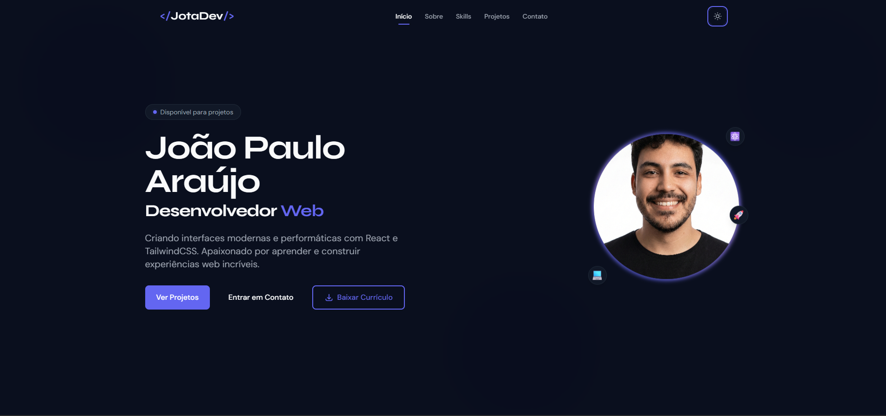

# 👨‍💻 João Paulo Araújo | Portfólio Pessoal

<div align="center">


Portfólio moderno, minimalista e altamente performático construído com **React**, animado com **GSAP** e estilizado com **TailwindCSS**. Projetado para demonstrar skills, projetos e facilitar o contato profissional de forma elegante.

</div>

<br />

<div align="center">
  
</div>

<br />

## ✨ Funcionalidades Destacadas

Este projeto vai muito além de um simples site estático. Ele incorpora arquitetura moderna e experiência imersiva:

*   🌗 **Tema Dinâmico (Dark/Light Mode):** Alteração de tema com transições suaves de cor e salvamento de estado no `localStorage` do usuário.
*   🎭 **Animações de Alta Performance:** Entrada de elementos e scroll animations controladas com `ScrollTrigger` e o poderoso hook `useGSAP`.
*   🚀 **Performance Otimizada:** Componentização extrema, Lazy Loading de assets e bundle otimizado através do Vite.
*   📱 **Design Mobile-First:** Grid responsivo em TailwindCSS garantindo que o portfólio funcione desde Smartwatches até monitores Ultrawide.
*   🎨 **Glassmorphism e Micro-interações:** UI rica em detalhes com desfoque de fundo na navegação (blur) e feedback instantâneo ao hover.
*   📝 **Formulário de Contato Inteligente:** Validação local eficiente sem dependências pesadas, avisando o usuário sobre erros apenas após a interação (onBlur).
*   📄 **Download Contínuo de CV:** Botão dinâmico na Hero section integrado aos recursos de assets do Vite para entregar o arquivo PDF perfeitamente.

---

## 🛠️ Tecnologias e Ferramentas

O ecossistema do portfólio foi cuidadosamente selecionado para manter máxima performance ao mesmo tempo que mantém uma DX (Developer Experience) incrível:

*   **[React 18](https://reactjs.org/)** - Renderização de UI, componentização e gerenciamento de estado
*   **[TailwindCSS (v3 / v4 ready)](https://tailwindcss.com/)** - Estilização baseada em classes de utilitário ágeis com suporte nativo a CSS Custom Properties (`rgb()`)
*   **[Vite](https://vitejs.dev/)** - Bundler HMR super-rápido de nova geração
*   **[GSAP & @gsap/react](https://gsap.com/)** - O padrão ouro para animações complexas baseadas na linha do tempo e posição de scroll
*   **Lucide React** - Ícones leves e versáteis SVG em formato React Components

---

## 🚀 Como Executar Localmente

### 1. Clonar o repositório
```bash
git clone https://github.com/jotaraujo/portfolio.git
cd portfolio
```

### 2. Instalar as Dependências
Usando `npm` (ou `pnpm` / `yarn` caso prefira):
```bash
npm install
```

### 3. Rodar o Ambiente de Desenvolvimento
```bash
npm run dev
```
> O comando iniciará o Vite e você poderá acessar com `http://localhost:5173`. O `Hot Module Replacement (HMR)` atualizará as páginas nas alterações instantaneamente.

---

## 📂 Visão Geral da Arquitetura

O projeto adota uma estrutura modular moderna e limpa:

```text
src/
├── assets/         # Recursos estáticos (imagens e o PDF de currículo)
├── components/     # Todos os blocos visuais Reutilizáveis
│   ├── layout/     # Estrutura base (Navbar, Footer)
│   ├── sections/   # Blocos maiores do App (Hero, About, Projects, Contact)
│   └── ui/         # Botões, Inputs e Labels atómicos 
├── contexts/       # React Context APIs (ex: ThemeContext)
├── hooks/          # Abstração de lógicas (ex: useContactForm, useDownload)
├── styles/         # Estilos globais essenciais (Variáveis e Animações GSAP base)
├── utils/          # Funções ajudantes independentes (ex: renderizador de classes cn())
└── constants/      # Abstração de texto que facilita tradução e alteração do conteúdo
```

---

## 📦 Scripts Disponíveis

*   `npm run dev` - Roda em localhost no ambiente Dev com HMR.
*   `npm run build` - Gera a compilação hiper otimizada para a pasta `/dist`.
*   `npm run preview` - Inicia um servidor local servindo a pasta de produção `dist` para testes rápidos.
*   `npm run lint` - Checa padrões de código com o linter nativo.

---

## 🤝 Autor e Contribuições

Desenvolvido e mantido por [João Paulo Araújo (JotaDev)](https://github.com/jotaraujo).

Criado com dedicação para quem busca uma base sólida ou inspiração open-source. Sugestões e contribuições (Issues e PRs) são muito bem-vindas! <3

---

<div align="center">
  <small>
    <b>Distribuído sob licença MIT.</b><br>
    © 2026 JotaDev - Todos os direitos reservados.
  </small>
</div>
